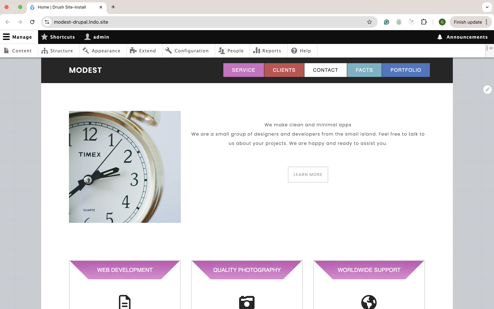
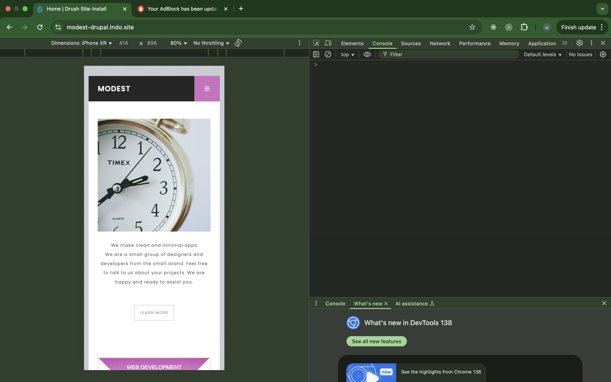
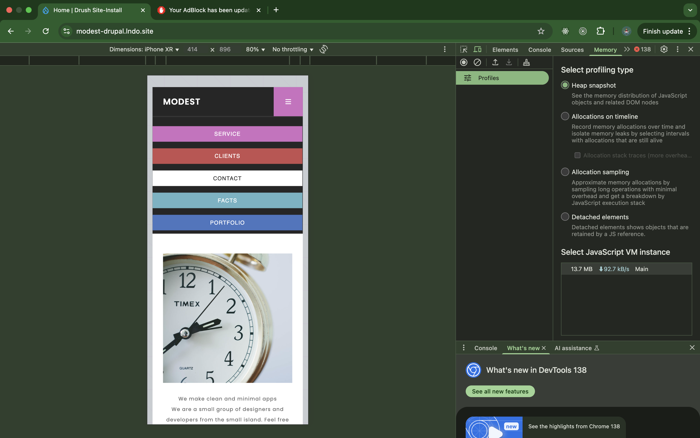
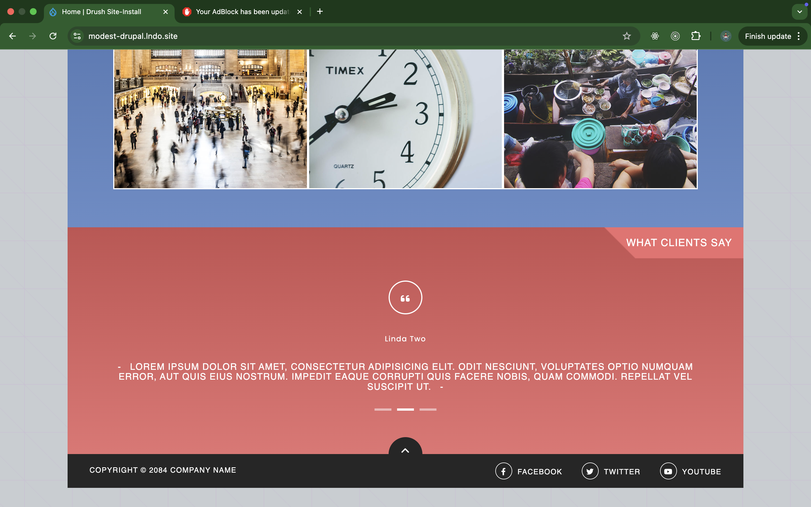
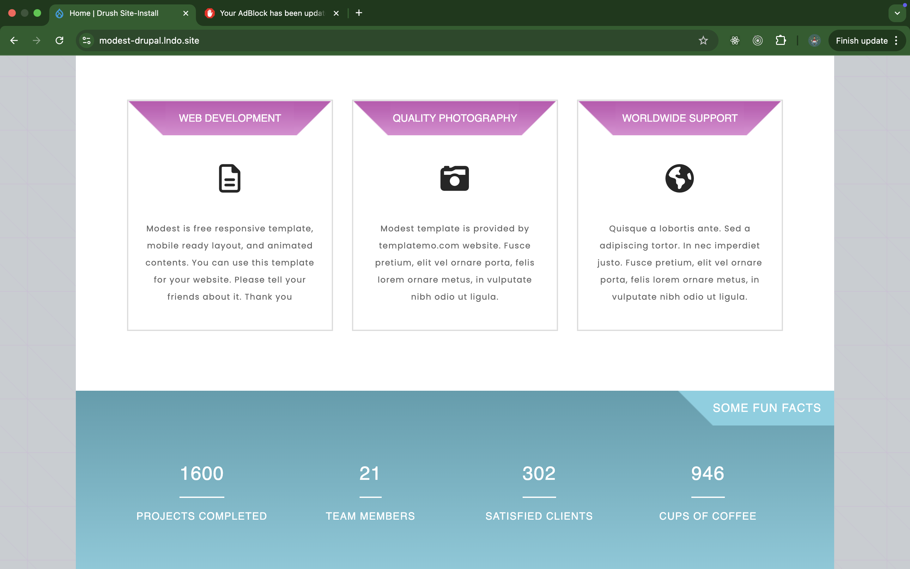

# Modest Drupal Theme 🧩  
[](https://github.com/Gursimran07316/Modest-theme-drupal)

A custom Drupal 10 theme inspired by the **Modest** HTML template from TemplateMo. Built with flexibility in mind using the Paragraphs module for reusable layout components.

## 🧱 Project Overview

This theme helps you build modern, clean landing pages by assembling content through reusable Paragraph components — similar to building React components.


## 🧩 Paragraph Types Included

| Paragraph Type   | Machine Name      | Description                              |
|------------------|-------------------|------------------------------------------|
| Welcome Section  | `welcome_section` | Hero image + title + description         |
| Services Section | `services_section`| Icon-based service blocks                |
| Image Gallery    | `image_gallery`   | Responsive image slider or grid          |
| Client Section   | `client_section`  | Testimonials or client quotes            |

Custom Twig templates are used for each paragraph in  
`/themes/modest_theme/templates/paragraph/`.

## 🗂️ File Structure
```bash
modest_theme/
├── css/
├── js/
├── images/
├── templates/
│   ├── block/
│   ├── field/
│   ├── menu/
│   ├── node/
│   ├── page/
│   ├── paragraph/
│   ├── region/
│   └── view/
├── modest_theme.info.yml
---
```
## 🧪 Local Setup

```bash
git clone https://github.com/Gursimran07316/Modest-theme-drupal.git
cd Modest-theme-drupal
# Copy the theme folder into your Drupal site's /themes/custom/ directory
# Then enable:
drush theme:enable modest_theme
drush config:set system.theme default modest_theme
---
```
## 🖥 UI Screenshot

Here’s a glimpse of the Modest Drupal theme homepage built using Paragraph types:







✅ Features
- Component-based layout with Paragraphs
- Bootstrap-based responsive layout
- Font Awesome for icons
- Custom field templates (field--*.html.twig)
- Easy to extend with more paragraph types

🧠 Credits
- HTML Template: TemplateMo – Modest #451
- Drupal Paragraphs module

📄 License

This project is for educational and personal use. Please credit TemplateMo if reusing the design.

⸻

Made with ❤️ by @Gursimran07316